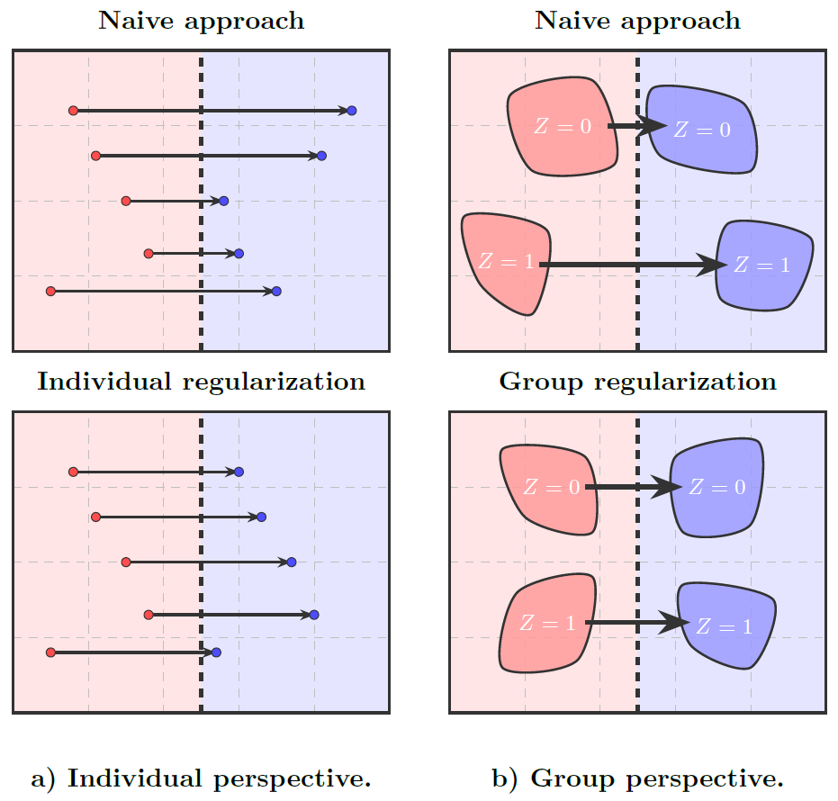

# Fair Optimal Transport Experiments



Optimal Transport for **fair** recourse: three experiments (F1-F3) that equalize
the cost of recourse across individuals and demographic groups.

## Experiments

| ID | Module | What it measures | Output CSV |
|----|--------|------------------|------------|
| F1 | `f1_individual_fairness` | **Individual fairness**: regularizes the plan with `λ_ind·(c−m)²` so each individual pays a similar transport cost. 10-fold CV over 14 `λ_ind` values × 7 datasets | `results/f1_individual_fairness.csv` |
| F2 | `f2_group_fairness` | **Group fairness**: per-group `θ_z` factor pushes above-average groups toward the global mean cost as `λ_g` grows. 10-fold CV over 34 `λ_g` values × 7 datasets | `results/f2_group_fairness.csv` |
| F3 | `f3_mixed_fairness` | **Mixed fairness**: combined group + individual with the enhanced stable solver (decoupled cost `θ_z·c + λ_ind·(c−m_z)²`, exact bisection θ, damped m, ε-annealing, log-domain Sinkhorn, warm-start). Grid 14 `λ_ind` × 34 `λ_g` × 10 folds × 7 datasets | `results/f3_mixed_fairness.csv` |

## Project structure

```
fairness/
├── fairopt/                  # the package (self-contained)
│   ├── core/                 # Sinkhorn (+ stable log-domain Sinkhorn), cost, metrics
│   ├── data/                 # dataset loaders + preprocessing
│   ├── solvers/              # individual, group, combined group+individual
│   ├── utils/                # ILR transform, simplex projection
│   └── experiments/          # f1, f2, f3, config, runner (CV harness), run_all
├── tests/                    # pytest suite (sinkhorn, solvers, ilr, simplex)
├── visualization.ipynb       # F1, F2, F3 plots + tables
├── pyproject.toml            # dependencies
├── Dockerfile                # reproducible container
└── Makefile                  # convenience targets
```

## Installation

Requires Python >= 3.10.

```bash
python -m venv .venv
source .venv/bin/activate        # Windows: .venv\Scripts\activate
pip install -e ".[viz]"          # -e . for experiments only
```

The `viz` extra adds Jupyter, matplotlib and seaborn for `visualization.ipynb`.

## Running the experiments

Each experiment writes CSVs into `results/` (created automatically).

```bash
# single experiments (10-fold CV)
python -m fairopt.experiments.f1_individual_fairness
python -m fairopt.experiments.f2_group_fairness

# F3 (enhanced mixed) — long run, resumable
python -m fairopt.experiments.f3_mixed_fairness --device cpu            # or cuda
python -m fairopt.experiments.f3_mixed_fairness --resume --device cpu   # skip done datasets

# everything sequentially
python -m fairopt.experiments.run_all
```

All three `run` functions also accept `use_cv=False` for a single 80/20 split
(useful for quick checks), e.g.
`python -c "from fairopt.experiments.f1_individual_fairness import run; run(use_cv=False)"`.

## Visualization

```bash
jupyter notebook visualization.ipynb
```

The notebook loads the CSVs from `results/` and renders the figures/tables for
F1, F2 and F3. Run the experiments first.

## Docker (reproducible environment)

```bash
make docker-build          # docker build -t fairopt-fairness .
make docker-run            # runs all experiments, results written to ./results
```

or manually:

```bash
docker build -t fairopt-fairness .
docker run --rm -v "$(pwd)/results:/app/results" fairopt-fairness
```

Override the default command to run a single experiment or the notebook server:

```bash
docker run --rm -v "$(pwd)/results:/app/results" fairopt-fairness python -m fairopt.experiments.f1_individual_fairness
docker run --rm -p 8888:8888 -v "$(pwd)/results:/app/results" fairopt-fairness jupyter notebook --ip=0.0.0.0 --allow-root
```

## Reproducibility notes

- **Network access is required on first run**: OpenML datasets (german, adult,
  LSAC, credit_default, student), the COMPAS CSV and the SA-heart / communities
  CSVs are downloaded from pinned URLs. Nothing is vendored.
- Randomness is seeded (`torch` seed 42, `KFold(random_state=42)`); F3 uses
  `FAIROPT_NUM_THREADS` to cap threading. Exact numeric output can still differ
  slightly across platforms due to BLAS/threading.
- F3's full grid is very expensive (≈7 datasets × 10 folds × 14 × 34 solves).
  Use `--resume` and run per-dataset to survive interruptions.

## Testing

```bash
pip install -e ".[dev]"
python -m pytest tests/ -v --tb=short
```

---

## F3 enhanced solver: why it is faster and converges better

F3 replaces the old E5 runner. The gains come from the solver + runner changes below.

### 1. Warm-starting across the λ grid (dominant runtime win)
The old `cross_validate` harness constructed a **fresh solver per (fold, λ_ind, λ_g)**
cell, cold-starting Sinkhorn potentials, θ and m_z from scratch every time.
F3 reuses **one solver instance per fold** across the whole grid and calls
`solver.reset()` only at each `λ_ind` boundary
(`f3_mixed_fairness.py:run_dataset`). Adjacent grid points have near-identical
optimal plans, so the warm-started potentials/θ/m_z converge in a fraction of the
iterations. This is the single biggest speedup.

### 2. Stable log-domain Sinkhorn
`core/sinkhorn_stable.py` keeps the potentials `f = ε·log u`, `g = ε·log v` in
**cost units** and never materializes `exp(−c/ε)`. Consequences:
- no numerical underflow on large costs or large λ (the old kernel-based Sinkhorn
  broke down exactly there);
- potentials can be warm-started across outer iterations while `ε` changes;
- the convergence test `max(|Δf|,|Δg|)/ε < tol` is scale-invariant (the old
  relative-to-|f| test diverged when potentials were near zero).

### 3. Exact, learning-rate-free θ update
For `d_z ≤ 4` groups, θ is the **closed-form minimizer** of the simplex-constrained
quadratic, found by bisection over the single KKT multiplier (`_solve_theta_exact`).
No learning rate to tune and no gradient noise; it converges in one shot.
For `d_z > 4` it falls back to a damped Adam step (`_solve_theta_adam`).
The per-group references `m_z` use a damped fixed-point update (`m_damping=0.5`),
stabilizing the block-coordinate loop.

### 4. Tuned outer-loop hyperparameters vs. the solver defaults
| Hyperparameter | Old E5 runner | F3 enhanced | Effect |
|----------------|---------------|-------------|--------|
| `warm_start` | `False` | `True` | reuse of potentials/θ/m_z |
| `eps_start` | 5.0 (default) | **0.1** | annealing starts at the floor ε; no wasted coarse-annealing iterations |
| `tol` (inner Sinkhorn) | 1e-6 | 1e-5 | permissive but sufficient given warm-start |
| `outer_tol` | 1e-6 | 1e-4 | target on relative group variance `var(avg_cost)/mean²` |
| `theta_damping` | 0.3 | 0.4 | slightly more conservative θ steps |
| `settle_iters` | 8 | 4 | shorter final settle at the target ε |
| `min_outer_iter` | 2 | 2 | never stop before 2 outer iterations |
| `outer_max_iter` | 20 | 100 | headroom if the fixed point needs more iterations |

### 5. Robust convergence criterion and best-snapshot retention
Convergence is declared when the relative group-variance
`rel_var = var(avg_costs)/mean² < outer_tol`, with an early-exit when
`θ_delta < 1e-4` **and** `m_delta < 1e-2`. A final "settle" phase at the target ε
tightens the fixed point, and the solver keeps the **best** (lowest-rel_var)
snapshot rather than the last iterate, so a transient divergence never corrupts
the reported plan/metrics.

### 6. Resumable, threaded, per-dataset execution
`--resume` skips datasets already present in `f3_mixed_fairness.csv`;
`FAIROPT_NUM_THREADS=16` uses the CPU more aggressively; results are appended per
dataset so a long run survives crashes without losing completed work.

> To quantify the speedup/convergence gain on your machine, compare
> `execution_time`, `n_iter` and `converged` columns of
> `f3_mixed_fairness.csv` against the legacy E5 CSV (`legacy/` contains the old
> runner) on the same grid/datasets.
